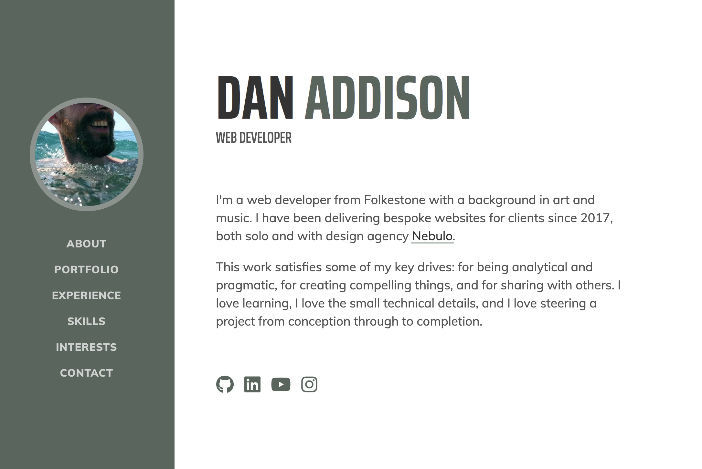

  

<h1 align="center">
  [My online resume](https://danaddisoncreative.com)
</h1>

Created with **Gridsome** `gridsome create new-project`.

I then copied lots of code from [this awesome starter](https://github.com/LokeCarlsson/gridsome-starter-resume) by Loke Carlsson. I did it the long way to learn more and to omit bootstrap from the project, but I haven't changed much about the design.

### Getting started

If you haven't already installed Gridsome CLI: `npm install --global @gridsome/cli`

1. `gridsome create my-gridsome-site https://github.com/DanAddison/DA-resume.git`
2. `cd my-gridsome-site` to open folder
3. `gridsome develop` to start local dev server at `http://localhost:8080`
4. Go nuts 🙌
